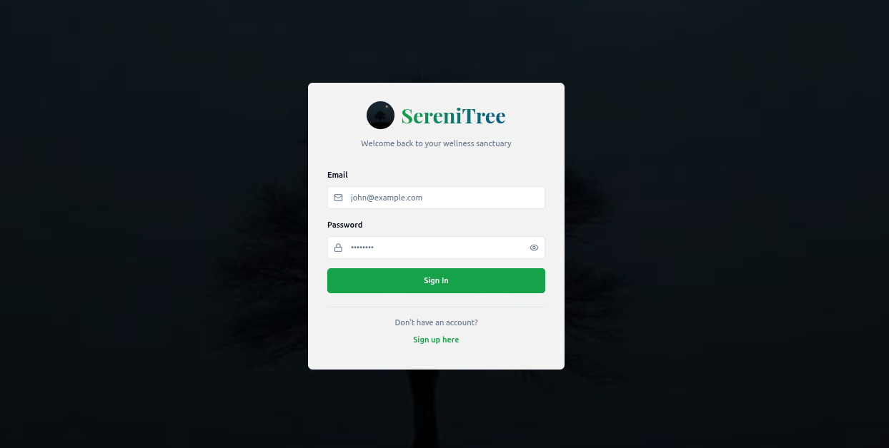

# Mind Buddy 🧠✨

[](https://opensource.org/licenses/MIT)
[](https://mind-buddy-ten.vercel.app/)
[](https://www.python.org/)
[](https://flask.palletsprojects.com/)
[](https://reactjs.org/)

> Your AI-powered companion for mental wellness and productivity.

**Mind Buddy** is a full-stack web application designed to help users track their mood, journal their thoughts, and gain insights through an interactive AI chat interface.

---

### ▶️ Live Demo

[**[your-live-mind-buddy-app](https://mind-buddy-ten.vercel.app/)**]

---



## 🌟 Features

### Core Features
- **Journaling**: A secure and private space to write down your thoughts.
- **Mood Tracking**: Log your daily mood to visualize trends over time.
- **User Authentication**: Secure sign-up and login functionality.
- **Responsive Design**: A seamless experience on both desktop and mobile devices.

### 🤖 AI-Powered Features (NEW!)
- **Sentiment Analysis**: Automatic emotion detection from journal entries using RoBERTa model
- **AI Chatbot (Sereni)**: Conversational AI companion for mental wellness support powered by Hugging Face models
- **Personalized Insights**: Daily wellness tips based on mood patterns
- **Crisis Detection**: Automatic detection of concerning keywords with immediate resources
- **Wellness Recommendations**: Activity suggestions (breathing, meditation, journaling) based on mood
- **Trend Analysis**: Visualize emotional patterns over time

📋 **For detailed AI features documentation, see [AI_FEATURES.md](AI_FEATURES.md)**

## 🛠️ Tech Stack

| Component | Technology |
| :--- | :--- |
| **Frontend** | JavaScript, React (or your framework), CSS |
| **Backend** | Python, Flask, Flask-SQLAlchemy, Flask-Migrate, Flask-CORS |
| **Database** | MongoDB (local/development), MongoDB Atlas (production) |
| **Deployment** | **Frontend:** Vercel / **Backend:** Render |

## 🚀 Getting Started

Follow these instructions to set up the project locally for development and testing.

### Prerequisites

Make sure you have the following installed on your machine:
- [Git](https://git-scm.com/)
- [Python 3.10+](https://www.python.org/downloads/)
- [Node.js & npm](https://nodejs.org/en/)
- [MongoDB](https://www.mongodb.com/try/download/community) (required for local development)

📋 **For detailed MongoDB setup instructions, see [MONGODB_SETUP.md](MONGODB_SETUP.md)**

### Installation & Setup

1.  **Clone the repository:**
    ```sh
    git clone https://github.com/Sereni-Crew/mind-buddy.git
    cd mind-buddy
    ```

2.  **Set up the Backend (Flask):**
    ```sh
    # Navigate to the backend directory
    cd backend

    # Create and activate a virtual environment (optional but recommended)
    python -m venv venv
    source venv/bin/activate  # On Windows, use `venv\Scripts\activate`

    # Install dependencies
    pip install -r requirements.txt

    # The .env file is already configured for local MongoDB
    # Default connection: mongodb://localhost:27017/mindbuddy
    # You can modify MONGO_URI in backend/.env if needed

    # Optional: Set Hugging Face model (default: microsoft/DialoGPT-small)
    # Available models:
    # - microsoft/DialoGPT-small (fast, ~117MB)
    # - microsoft/DialoGPT-medium (balanced, ~345MB)
    # - TinyLlama/TinyLlama-1.1B-Chat-v1.0 (good quality, ~2.2GB)
    # export HF_MODEL_NAME="microsoft/DialoGPT-medium"

    # Optional: Configure generation parameters
    # export MAX_NEW_TOKENS="256"  # Response length
    # export TEMPERATURE="0.7"     # Creativity (0.1-1.0)
    # export TOP_P="0.9"           # Diversity

    # Start the backend server (usually on http://127.0.0.1:5000)
    python run.py
    # Or use Flask directly:
    flask run
    ```

    **Note**: MongoDB does not require migrations like SQL databases. Collections are created automatically when first used.

3.  **Set up the Frontend (React):**
    ```sh
    # Open a new terminal and navigate to the frontend directory
    cd frontend

    # Install dependencies
    npm install

    # Configure the backend API URL if needed
    # Check frontend/.env.local or create one with:
    # VITE_API_BASE_URL=http://127.0.0.1:5000

    # Start the frontend development server (usually on http://localhost:5173)
    npm run dev
    ```

4.  **Access the Application:**
    - Frontend: http://localhost:5173
    - Backend API: http://localhost:5000
    - API Health Check: http://localhost:5000/api/health

## 🚢 Deployment

This project is structured as a monorepo and is optimized for a split deployment:

### Frontend Deployment (Vercel)

1. **Connect Repository**: Link your GitHub repository to Vercel.
2. **Project Settings**:
   - **Root Directory**: `frontend`
   - **Build Command**: `npm run build`
   - **Output Directory**: `dist`
   - **Install Command**: `npm install`
3. **Environment Variables** (if needed):
   - `VITE_API_BASE_URL`: Your backend API URL (e.g., `https://your-backend.onrender.com`)
4. **Deploy**: Vercel will automatically deploy on every push to the main branch.

### Backend Deployment (Render)

1. **Create Web Service**: Connect your GitHub repository to Render.
2. **Service Settings**:
   - **Root Directory**: `backend`
   - **Runtime**: `Python 3`
   - **Build Command**: `pip install -r requirements.txt`
   - **Start Command**: `gunicorn --bind 0.0.0.0:$PORT app:app`
3. **Environment Variables**:
   - `MONGO_URI`: Your MongoDB Atlas connection string
   - `SECRET_KEY`: A secure random string for Flask sessions
   - `HF_MODEL_NAME`: Hugging Face model name (optional, defaults to `microsoft/DialoGPT-small`)
   - `MAX_NEW_TOKENS`: Response length (optional, default 256)
   - `TEMPERATURE`: Creativity level (optional, default 0.7)
   - `TOP_P`: Diversity (optional, default 0.9)
   - `FLASK_ENV`: `production`
4. **Database**: Ensure MongoDB Atlas is set up and accessible.
5. **Deploy**: Render will build and deploy your backend.

### Deployment Checklist

- [ ] Backend deployed on Render with environment variables set
- [ ] Frontend deployed on Vercel with API base URL configured
- [ ] MongoDB Atlas database connected
- [ ] Test API endpoints after deployment
- [ ] Verify frontend can communicate with backend

## 📄 License

This project is licensed under the MIT License. See the LICENSE file for details.

---

Made with ❤️ by Sereni Crew💡
